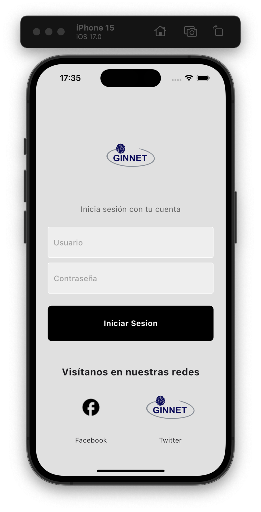
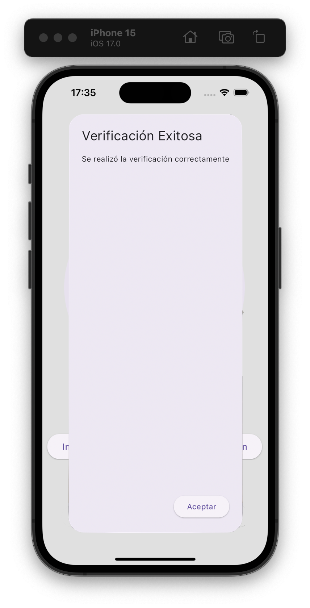

# iClass SEL: Online Assesments Supervisory Software

## Setup

Run the following commands from your terminal:

1) `git clone https://github.com/WilmarTarazona/iclass-mobile-ginnet` to clone this repository 

2) `flutter pub get` in the project root directory to install all the required dependencies.

## Screenshots

<table width="100%">
  <tbody>
    <tr>
      <td width="1%"></td>
      <td width="1%"></td>
       <td width="1%"></td>
    </tr>
  </tbody>
</table>
Characteristics
- [X] Automatic supervision using logic based on Artificial Intelligence controls the student's eye movements, if present, if they make computer changes.
- [X] Live supervision: When the Teacher or exam supervision presents alerts of students who are carrying out inappropriate actions.
- [X] Disable software, tabs, virtual machines, development tools, unauthorized tools, external ports, disks and other types of connections,
- [X] Disables copy and paste, Print commands, right click, screenshot, screen recording.
- [X] Measure the credibility of each student using our credibility index reports.
